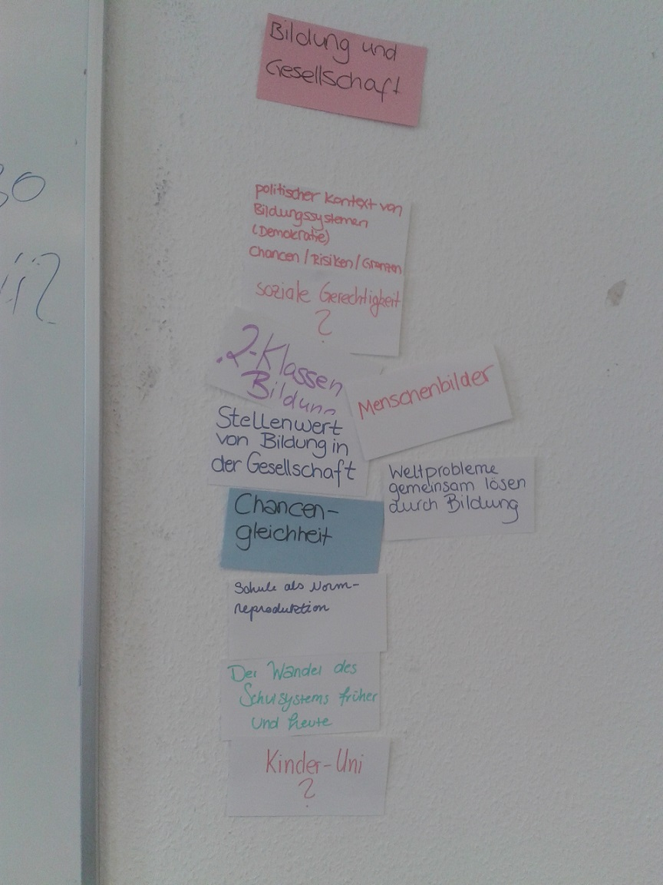

# Themen der Bildung II

In dieser Sitzung finden wir Überthemen (Cluster) zu euren Themen aus der [letzten Woche](02_Themen der Bildung I.md) gefundenen Themen. Die Cluster dienen euch als Grundlage für die Auswahl eures Hausarbeitsthemas. Ich werde im Anschluss des Seminars Ressourcen und Ideen zusammen stellen, die euch helfen, ein eigenes Thema zu finden und erste Anhaltspunkte für eure Hausarbeiten zu haben.

## Aufbau der Sitzung

| Thema		| Zeit		 |  Methode		|
| ---- 		| ----- | --- |
| Begrüßung und offene Fragen | 00:00 - 00:10 | Informelles Gespräch |
| Einführung in das Clustering | 00:10 - 00:25 | Vortrag |
| Clustering | 00:25 - 01:25 | Gruppenarbeit |
| Abschluss | 01:25 - 01:30 | Informelles Gespräch |

## Gruppenarbeit Clustering

1. 5-er Gruppe (15min). Betrachtet die Themen der letzten Sitzung und findet Überthemen zu diesen Aussagen. Findet mindestens 4 Überthemen.
2. In der Gruppe (15 min). Wir betrachten die Cluster der einzelnen Gruppen und entfernen Dopplungen. Wir einigen uns auf maximal 6 Cluster.
3. In der Gruppe (10 min). Jede Person kann ein eigenes Thema auf eine Karte schreiben und dieses mit zu den anderen Themen legen. Jede Person ordnet anschließend die Themen den Clustern zu. 
4. In der Gruppe (20 min). Zusammen einigen wir uns auf die Einordnung der Themen in die Cluster. Die Cluster können in diesem Prozess auch verändert werden. Am Ende sollten wir ein Cluster der Überthemen haben, in denen Ihr euer Thema der Hausarbeit wiederfinden könnt.

#### Ergebnis

In den beiden Seminaren haben wir vier Cluster zusammen getragen. Innerhalb der vier Cluster ordnen wir eure Hausarbeiten ein. Erste Ideen für Hausarbeiten findet Ihr in der folgenden Liste:

* Bildung und Gesellschaft
	* Die Funktion von Schule
	* Bildungstheorien (im Vergleich) (z.B. Harmut von Hentig, John Dewey)
	* Die Veränderung des Hochschulwesens durch den Bologna-Prozess
	* Die Rolle der Lehrperson
	* Inklusionskonzepte
	* Blended-Learning im Hochschulwesen
	* Digitalisierung der Bildung (z.B. MOOCs, Blended-Learning)
	* Die Ausbildung des Deutschen Bildungssystems
* Bildungssysteme im internationalen Vergleich
	* Zweiländervergleich hinsichtlich spezifischer Outcomevariablen (z.B. Stressempfinden von Lehrkräften, mathematische Kompetenz)
	* Alternative Schulsysteme im Vergleich
	* Die Messung von Bildung in den PISA-Studien
	* Statistische Methodik der PISA-Studien
	* Ergebnisse der PISA-Studien in Mathematik/Lesen/Naturwissenschaft
	* Wirkfaktoren guter Bildung nach PISA
* Bildungsziel und Menschenbild
	* Der Kompetenzbegriff der Bildung
	* Die Rolle der Lehrperson
	* Das Ziel von Bildung
* Politischer und ökonomischer Kontext von Bildung
	* Die Entstehung von PISA
	* Der Einfluss auf internationale Bildungssysteme durch PISA

### Cluster Gruppe Dienstag

### Cluster Gruppe Mittwoch

<!--* Bildungsverständnis
	* Singapur vs. Finnland. Wer gewinnt?
	* Schüler sollen selbst entscheiden, was sie lernen.
	* Besonderheit des finnishcen Schulsystems
	* Der Lehrerberuf als gestalterischen, reflexiven Prozess.
	* Wissensvermittlung vs. Persönlichkeitsentwicklung?!
	* "Waking them up". Weg vom klassischen Einschätzungen / Regulation hin zum freien Denken, Soft Skills, ...
	* Ruhig gestellte Fließbandabfertigung oder kreative Individuen?
	* BNE - Bildung für nachhaltige Entwicklung
	* Transfer eines etablierten Bildungssystems auf andere Länder möglich?
	* Was ist Bildung. Was sind Ziele von Bildung?
	* Persönliche Entwicklung > Effizient
	* Standardisierung vs. Individualität
	* Schulwissen im Vergleich zu echt notwendigem Lebenswissen
	* Schule als Lebens - & Erfahrungsraum
* Bildung und Gesellschaft
	* politischer Kontext von Bildungssystemen (Demokratie), Chancen / Risiken / Grenzen /, soziale Gerechtigkeit-->

## TODO nach der Sitzung

* **Dozent**. Ich suche und bennene Themen und Ressourcen für eure Cluster. 
* **Studierende**. Ihr überlegt euch ein Thema für eure Hausarbeit. Erstellt in [GitBook](https://www.gitbook.com/book/ch-bu/seminar-bildungssysteme-2016/detailst) eine Datei unter dem Ordner **Studierendenarbeiten** (Rechtsklick auf den Ordner -> New File). Bennent diese Datei nach eurem Thema und endet diese Datei mit **.md**. Die Dateiendung **.md** ist sehr wichtig! Schreibt einen kleinen Text über euer Thema / eure Fragestellung (max 300 Wörter). Speichert eure Veränderungen ab. Deadline für diese Aufgabe ist Montag, der 09.05.2016.

<!-- 

	Internationale Vergleichsstudien
* Alternativen zu PISA
* Contra PISA
* Pro PISA
* Was ist PISA?
* PISA. Eine zu eingeschränkte Messung?
* OECD. Ist die Qualität der Bildung egal???
* Weltweites Lernen und dessen Assessment
* PISA: Kurzfristige Bildungserfolge vs. langjährige Bildungsänderungen
* Bildungsmonitoring

Funktion von Bildungssystemen
* Ruhig gestellte Fließbandabfertigung oder kreative Individuen?
* Lernen als Bruttoinlandsprodukt
* Weltprobleme gemeinsam lösen durch Bildung
* Persönliche Entwicklung > Effizient
* Wissensvermittlung vs. Persönlichkeitsentwicklung
* Schulsysteme im Vergleich zu "echt notwendigem" Lebenswissen
* Bildung als Ware?
* Schule - Wahre Bildung statt Erziehung
* "Waking them up" Weg von klassischen Einschränkungen / Regulation hin zum freien Denken, Soft Skills,
* Was ist Bildung? Was sind Ziele von Bildung? (Leistung)
* Schule als Normreproduktion
* Schule als Lebens- und Erfahrungsraum
* Sind schulische Institutionen indoktrinierend oder fördern sie auch ausreichend Kreativität?

Bildungssysteme im Vergleich
* Singapur vs. Finnland. Wer gewinnt?
* Aufgliederung des Bildungssystems (länderspezifisch, zeitspezifisch)
* Der Wandel des Schulsystems früher und heute
* Besonderheit des finnischen Schulsystems
* Transfer eines etablierten Bildungssystems auf andere Länder möglich?
* Politischer Kontext von Bildungssystemen (Demokratie). Chancen, Risiken, Grenzen.

Digitalisierung der Bildungssysteme
* Online Weiterbildung (Udacity)
* Deep Learning
* personalisiertes Lernen
* Neue Lehr- und Lernmethoden durch Online Unterricht in Schulen

Probleme und Kritik von und an Bildungssystemen
* Chancengleichheit
* soziale Gerechtigkeit?
* 2-Klassen Bildung
* Standardisierung vs. Individualität
* Heiße Luft (?)
* Stellenwert von Bildung in der Gesellschaft
* Bildung - rentable Investition ohne Garantie auf Karriere

Die Gestaltung des Unterrichts und der Lehrpersonen
* Schüler sollen selbst entscheiden, was sie lernen.
* Der Lehrerberuf als gestalterischen, reflexiven Prozess
* "Teaching is talking, learning is listening"?

Miscallenaous
* Menschenbilder
* Finanzierung und Kosten von Bildung (Costs & Investment)
* Kinder-Uni?
* BNE - Bildung für nachhaltige Entwicklung

-->